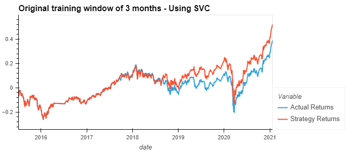
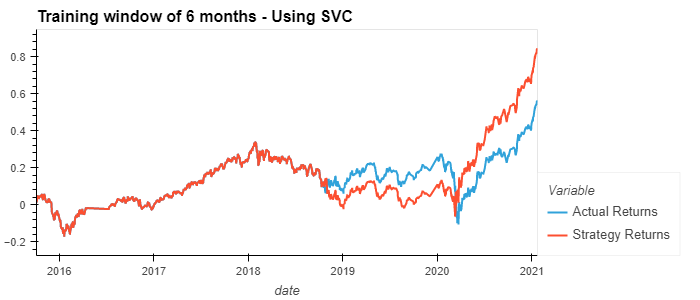
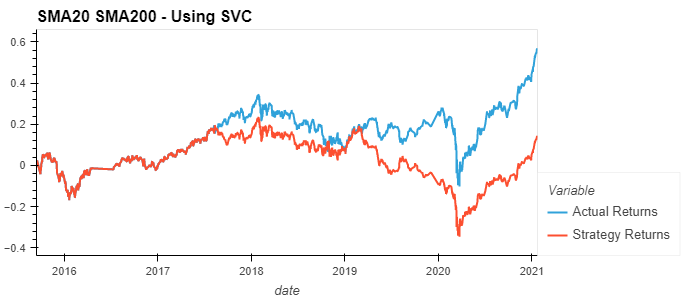
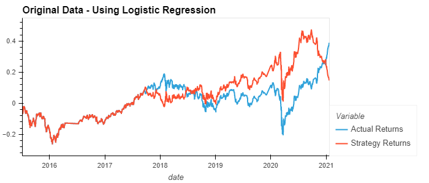

# Module_14_algo_trading_assignment

# Summary and Analysis

- Model 1: Original Data (3 months training data): 0.55
- Model 2:Changing training and testing dataset split(6 months training data): 0.56
- Model 3:Changing SMA windows(from SMA4 and SMA100 to SMA20 and SMA200): 0.55
- Model 4:Using another model with the original data (Logistic Regression):0.52

Model 2 has the highest accuracy among the 4 methods.

According to the plots:

- Model 4 has the lowest score of precision and recall for signal 1. Thus, I will not choose this model.

- model 3's actual returns are always higher than strategy returns (based on predictions), which means the model is more pesimistic than the reality, this kind of prediction may let us miss investment opportunities since the prediction is lower than the actual return. Model 3 has a similar precision and a lower recall score of signal 1 comparing with model 1 and 2. From visual comparison, the gap between actual return and strategy return in model 3 is bigger than model 1 and 2, for these reasons, I will not choose model 3 either.

- model 1's  actual returns are always lower than strategy returns (based on predictions), this may let us lose money since the model is more optimistic than the reality.

- model 2 has a higher recall score of signal 1 but lower recall score of signal -1 comparing with model 1.

We cannot jump into a certain conclusion about which is the best, since the accuracy difference is not big and the choice of the model also depend on our investment strategy and risk tolerance. But I'll recommend model 2 since it seems a balanced model (not too optimistic or pesimistic) and do have a higher recall score of signal 1 which will catch the opportunites to invest in.

